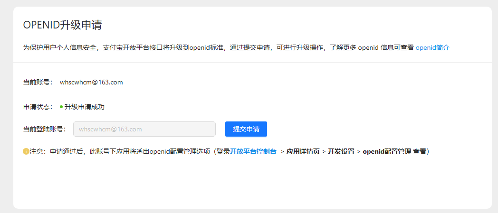

https://opendocs.alipay.com/pre-open/05pag1?pathHash=11866c63
https://opendocs.alipay.com/pre-open/07tx1k?pathHash=85dcc9f9

openid 标准目前会对部分新增 APPID 进行灰度，灰度中应用原有涉及 userid 的接口将会支持 openid，详情可查看 openid 相关的接口清单。未处于灰度中的应用可查看 账号升级openid申请指南 进行自助申请。
页面配置操作：登录 开放平台控制台 > 应用详情页 > 开发设置 > openid配置管理 点击 设置 进行查看/修改应用openid 用户标识。
说明：如暂时无法支持 openid 标准，可选择回退至 userid 标准，操作详情可查看 无法使用openid申诉。

背景介绍
uid 作为支付宝系统内标，在数字化业务开放过程面临着不断升级要求，为了减少开发者适配改造成本，支付宝将统一提供 openid 作为稳定且唯一的用户的标识。同时支付宝还将围绕 openid 不断开放 棋盘密云、小橱窗 等一系列特色营销产品能力，帮助商家更好的进行数字化升级。
openid 相比 userid 的优势
• 用户在应用下的标识后续将统一切换到 openid，系统内部标识 userid 会进行升位扩展。
• 尽早使用 openid 可以避免 userid 变更产生的影响，开发成本更低。
• 棋盘密云、会员营销等新产品仅支持 openid。
注意：支付宝未来推出的新产品将只支持 openid。

